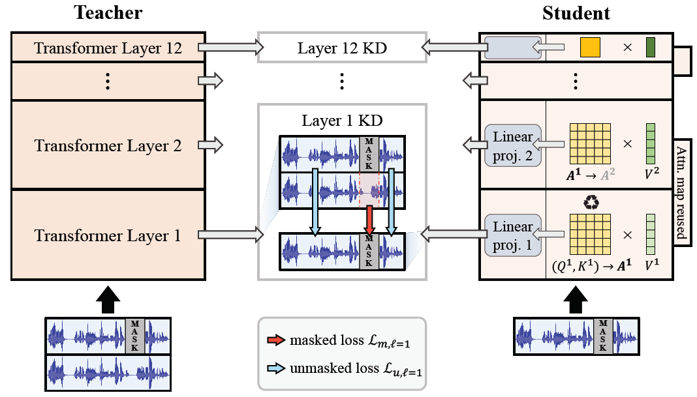
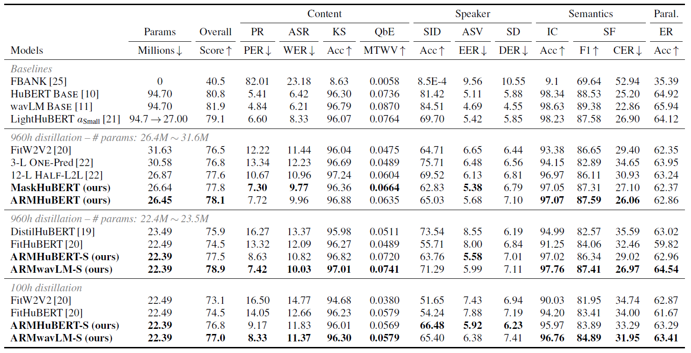
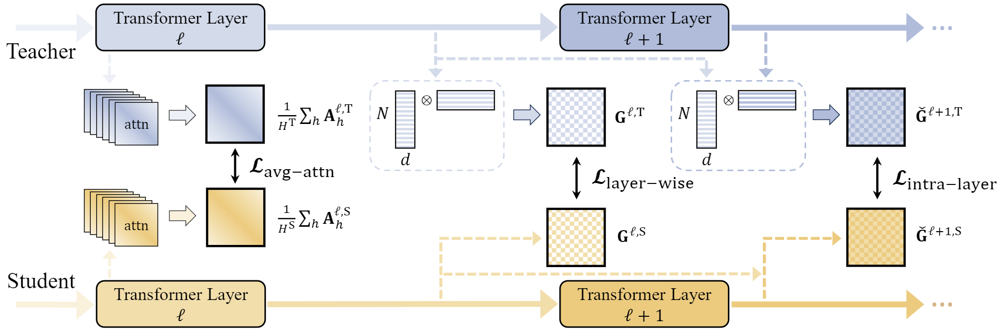
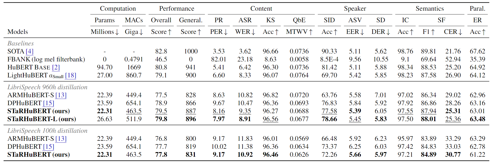

# ♽ Recycle-and-Distill (Interspeech 2023)

<a href='https://arxiv.org/abs/2305.11685'></a>  <a href=#bibtex></a> 
<a href='https://superbbenchmark.org/leaderboard'></a>
<a href='https://huggingface.co/sungnyun/ARMHuBERT'></a> <a href='https://huggingface.co/sungnyun/ARMHuBERT'></a>

<br>

<p align="center">

</p>

[**Recycle-and-Distill: Universal Compression Strategy for Transformer-based
Speech SSL Models with Attention Map Reusing and Masking Distillation**](https://arxiv.org/abs/2305.11685), INTERSPEECH 2023.

[Kangwook Jang](https://scholar.google.com/citations?user=p8GFX-sAAAAJ&hl)\*,
[Sungnyun Kim](https://bit.ly/sungnyunkim)\*,
[Se-Young Yun](https://fbsqkd.github.io), [Hoirin Kim](https://scholar.google.com/citations?user=naLHjOsAAAAJ&hl=en)<br/>
\* equal contribution

- **Attention Map Reusing**: Reuse previous layer's attention map to remove key & query parameters in Transformer
- **Masking Distillation**: Masking distillation treating masked frames and unmasked frames separately
- Parameters and MACs of ARMHuBERT have decreased to **28% and 30%** of the teacher, HuBERT Base, respectively.
- ARMHuBERT achieves **PER of 7.72%, WER of 9.96%** on the SUPERB benchmark in an E2E distillation manner.

📌 Check out our model's performance in [SUPERB Leaderboard](https://superbbenchmark.org/leaderboard)!    


### 🤗 Checkpoints
For our model's checkpoints, go check this [link](https://huggingface.co/sungnyun/ARMHuBERT/tree/main)!

| Model name       | Parameters | Teacher | Training dataset | Link |
|------------------|------------|---------|------------------| ---- |
| ARMHuBERT-960h   | 26.45M     | HuBERT  | LibriSpeech-960h | [HF Model](https://huggingface.co/sungnyun/ARMHuBERT/blob/main/ARMHuBERT-960h.ckpt) |
| ARMHuBERT-S-100h | 22.39M     | HuBERT  | LibriSpeech-100h | [HF Model](https://huggingface.co/sungnyun/ARMHuBERT/blob/main/ARMHuBERT-S-100h.ckpt) |
| ARMHuBERT-S-960h | 22.39M     | HuBERT  | LibriSpeech-960h | [HF Model](https://huggingface.co/sungnyun/ARMHuBERT/blob/main/ARMHuBERT-S-960h.ckpt) |
| ARMwavLM-S-100h  | 22.39M     | wavLM   | LibriSpeech-100h | [HF Model](https://huggingface.co/sungnyun/ARMHuBERT/blob/main/ARMwavLM-S-100h.ckpt) |
| ARMwavLM-S-960h  | 22.39M     | wavLM   | LibriSpeech-960h | [HF Model](https://huggingface.co/sungnyun/ARMHuBERT/blob/main/ARMwavLM-S-960h.ckpt) |
| MaskHuBERT-960h  | 26.64M     | HuBERT  | LibriSpeech-960h | [HF Model](https://huggingface.co/sungnyun/ARMHuBERT/blob/main/MaskHuBERT-960h.ckpt) |


<br>

# How to use this repo

## Requirements
Install the necessary packages with: 
```
$ pip install -r requirements.txt
```


## Distillation
1. Download the teacher model checkpoint to perform knowledge distillation, and place it under the root path, `./`.

	+ For HuBERT Base: [link](https://github.com/facebookresearch/fairseq/tree/main/examples/hubert) (`hubert_base_ls960.pt`)
	+ For wavLM Base: [link](https://huggingface.co/s3prl/converted_ckpts/tree/main) (`wavlm_base.pt`)

2. Download the [LibriSpeech](https://www.openslr.org/12) dataset.

	+ For 100h distillation, download `train-clean-100`
	+ For 960h distillation, download whole dataset, `train-clean-100`, `train-clean-360`, `train-other-500`
	+ For validation, download `dev-clean`
		+ You can validate your model with test clean other either. In this case, please download `test-clean`, and modify `self.eval_data` in `train.py` file.

3. Modify the configuration file in `./conf/[model_name]/[config].yaml`.    
	+ For example, the configuration file `./conf/armhubert/armhubert-960.yaml` contains all the settings for reproducing ARMHuBERT on LibriSpeech 960h dataset.	
	+ Set the path to the teacher model checkpoint at `teacher_model`, and the root path to the LibriSpeech dataset at `libri_root`. 

4. Then, run the following command:
```
python train.py -c ./conf/[model_name]/[config].yaml
```

For ARMHuBERT,
	```
	python train.py -c ./conf/armhubert/armhubert-960.yaml
	```

After training, the model checkpoints and the corresponding configuration file will be created at `./results/pretrain/`.


## Fine-tuning
0. If you don't feel like training your model, feel free to use our [checkpoints](https://huggingface.co/sungnyun/ARMHuBERT/tree/main).
   
2. Clone and install the [S3PRL toolkit](https://github.com/s3prl/s3prl) with ```pip install -e ".[all]"``` (dev mode).

3. Copy the entire `./models/[model_name]` folder into `<s3prl root>/s3prl/upstream/`.

4. Please add upstream importing line in `<s3prl root>/s3prl/hub.py`.
	
	```
	from s3prl.upstream.[model_name].hubconf import *
	```
	For ARMHuBERT,
	```
	from s3prl.upstream.armhubert.hubconf import *
	```

5. Please change each config file of s3prl downstream tasks as follows.
	+ Uncomment learning rate scheduler
	+ Learning rate scaled to 10x in spekaer identification (SID) task

6. Run the following command to fine-tune the ARMHuBERT model.

	For automatic speech recognition (ASR) as an example:
	```
	python run_downstream.py \
	-m train \
	-n ARMHuBERT-ASR \  # You can set your exp name whatever you want
	-u armhubert \
	-d asr \
	-k <path to .ckpt file in <git root>/results/pretrain/> \
	-g <path to .yaml file in <git root>/results/pretrain/>
	```
	Note: Refer to the [SUPERB docs](https://github.com/s3prl/s3prl/blob/master/s3prl/downstream/docs/superb.md) for more information on usage details and data preparation.

## Result

<p align="center">

</p>

We evaluate our student models on the SUPERB benchmark.

MaskHuBERT highly improves the performances in content- and semantics-related tasks. See PR, ASR, SF, and IC.

ARMHuBERT shows promising improvements when compared to MaskHuBERT in SF and SID tasks, exhibiting a similar level of performance in other tasks.

ARMHuBERT achieves a better overall score of **78.1** with less parameters than MaskHuBERT.
This is an state-of-the-art performance for an end-to-end distillation approach such as [Deep-versus-wide 12-L](https://arxiv.org/abs/2207.06867?context=eess.AS) or [FitHuBERT](https://arxiv.org/abs/2207.00555).

You can also check that our model works on other Transformer backbone model, [wavLM](https://arxiv.org/abs/2110.13900), too.

## Try this distillation strategy with your Transformer backbone models
We have only performed evaluation on HuBERT-based models, but this strategy can be performed identically on any speech model with a Transformer backbone. E.g. [AST](https://arxiv.org/abs/2104.01778) (Audio Spectrogram Transformer).


## BibTeX
If you find this repo useful for your research, please consider citing our paper:
```
@article{jang2023recycleanddistill,
         title={Recycle-and-Distill: Universal Compression Strategy for Transformer-based Speech SSL Models with Attention Map Reusing and Masking Distillation}, 
         author={Kangwook Jang and Sungnyun Kim and Se-Young Yun and Hoirin Kim},
	 	 booktitle={Proc. INTERSPEECH 2023},
  		 pages={316--320},
         year={2023}
}
```

<br>

# ♽ STaR (ICASSP 2024)  
<a href='https://arxiv.org/abs/2312.09040'></a>  <a href=#bibtex></a> 
<a href='https://superbbenchmark.org/leaderboard'></a>

📌 Update (Apr 12, 2024): Our paper is selected as a (**Best Student Paper**) in ICASSP 2024!
<br>
📌 Check out our model's performance in [SUPERB Leaderboard](https://superbbenchmark.org/leaderboard)! 

<p align="center">

</p>

[**STaR: Distilling Speech Temporal Relation for Lightweight Speech Self-Supervised Learning Models**](https://arxiv.org/abs/2312.09040), ICASSP 2024.

[Kangwook Jang](https://scholar.google.com/citations?user=p8GFX-sAAAAJ&hl),
[Sungnyun Kim](https://bit.ly/sungnyunkim),
[Hoirin Kim](https://scholar.google.com/citations?user=naLHjOsAAAAJ&hl=en)<br/>

- **<U>S</U>peech <U>T</U>empor<U>a</U>l <U>R</U>elation (STaR)**: Distill the knowledge by focusing on the pairwise **temporal relation** between two speech frames.
- **Temporal Gram Matirx**: Propose temporal Gram matrix (TGM) which aggregates channel information at two time steps.
  - Layer-wise TGM: Distill the TGM for every Transformer layer
  - Intra-layer TGM: Modify the TGM as computing the temporal relation between the input and output of a single Transformer layer.
- Incorporating two TGMs as the distillation objectives together, our student model STaRHuBERT (22M & 26M) shows the SOTA performance on the SUPERB benchmark with the metric of overall and generalizability scores.
- For further compression (9.39M & 14.1M), our approach shows the robust performance against degradation compares to other works.

<p align="center">

</p>

<p align="center">

</p>


## Checkpoints
For our model's checkpoints, please check the following links. All models are distilled from HuBERT base.

- STaRHuBERT-L (26.6M): [ckpt](https://drive.google.com/file/d/1La5jh0jPv-JCk2ECT2raRHtXMYYJNtsF/view?usp=drive_link), [yaml](https://drive.google.com/file/d/1NpHhMVj7EE1Sx5eG3tX5fMCa4UUlrnwI/view?usp=drive_link)
- STaRHuBERT (22.3M): [ckpt](https://drive.google.com/file/d/1Zu1idRx-sVaqMvRsUKtttzkSn4df6TUr/view?usp=drive_link), [yaml](https://drive.google.com/file/d/1C6ZcYM4Fcxj0vurid5N02BAANj4smr8U/view?usp=drive_link)
- STaRHuBERT-S (14.1M): [ckpt](https://drive.google.com/file/d/1sUpbDupbDtlCvN-49TblUn8GDmhV8MT8/view?usp=drive_link), [yaml](https://drive.google.com/file/d/1OFjIo1UjxNrxEboKaT8Z-vtuL6xmyNsu/view?usp=drive_link)
- STaRHuBERT-XS (9.39M): [ckpt](https://drive.google.com/file/d/1sUpbDupbDtlCvN-49TblUn8GDmhV8MT8/view?usp=drive_link), [yaml](https://drive.google.com/file/d/1OFjIo1UjxNrxEboKaT8Z-vtuL6xmyNsu/view?usp=drive_link)

## Distillation
We do not offer an official implementation code for distillation.
Since STaRHuBERT is developed with the backbone of ARMHuBERT repository, you can implement our apporach with ARMHuBERT repository.


## Fine-tuning
You can reproduce our model with given checkpoints. Please follow the steps. (This is almost the same as ARMHuBERT case.)
   
1. Clone and install the [S3PRL toolkit](https://github.com/s3prl/s3prl) with ```pip install -e ".[all]"``` (dev mode).

2. Copy the entire `./models/starhubert` folder into `<s3prl root>/s3prl/upstream/`.

3. Please add upstream importing line in `<s3prl root>/s3prl/hub.py`.	
	```
	from s3prl.upstream.starhubert.hubconf import *
	```

4. Please change each config file of s3prl downstream tasks as follows.
	+ Uncomment learning rate scheduler
	+ Learning rate scaled to 10x in spekaer identification (SID) task

5. Run the following command to fine-tune the ARMHuBERT model.

	For automatic speech recognition (ASR) as an example:
	```
	python run_downstream.py \
	-m train \
	-n STaRHuBERT-ASR \  # You can set your exp name whatever you want
	-u starhubert \
	-d asr \
	-k <path to .ckpt file in <git root>/results/pretrain/> \
	-g <path to .yaml file in <git root>/results/pretrain/>
	```
	Note: Refer to the [SUPERB docs](https://github.com/s3prl/s3prl/blob/master/s3prl/downstream/docs/superb.md) for more information on usage details and data preparation.


## BibTeX
If you find this repo useful for your research, please consider citing our paper:
```
@inproceedings{jang2024star,
  title={STaR: Distilling Speech Temporal Relation for Lightweight Speech Self-Supervised Learning Models},
  author={Jang, Kangwook and Kim, Sungnyun and Kim, Hoirin},
  booktitle={Proc. ICASSP 2024},
  pages={10721--10725},
  year={2024},
  organization={IEEE}
}
```

## Contact
- Kangwook Jang: dnrrkdwkd12@kaist.ac.kr
- Sungnyun Kim: ksn4397@kaist.ac.kr
